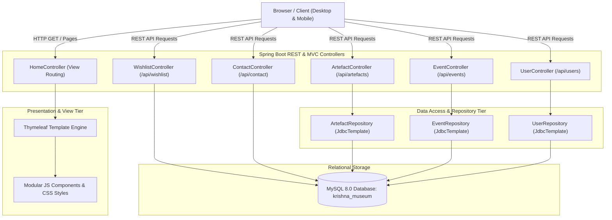
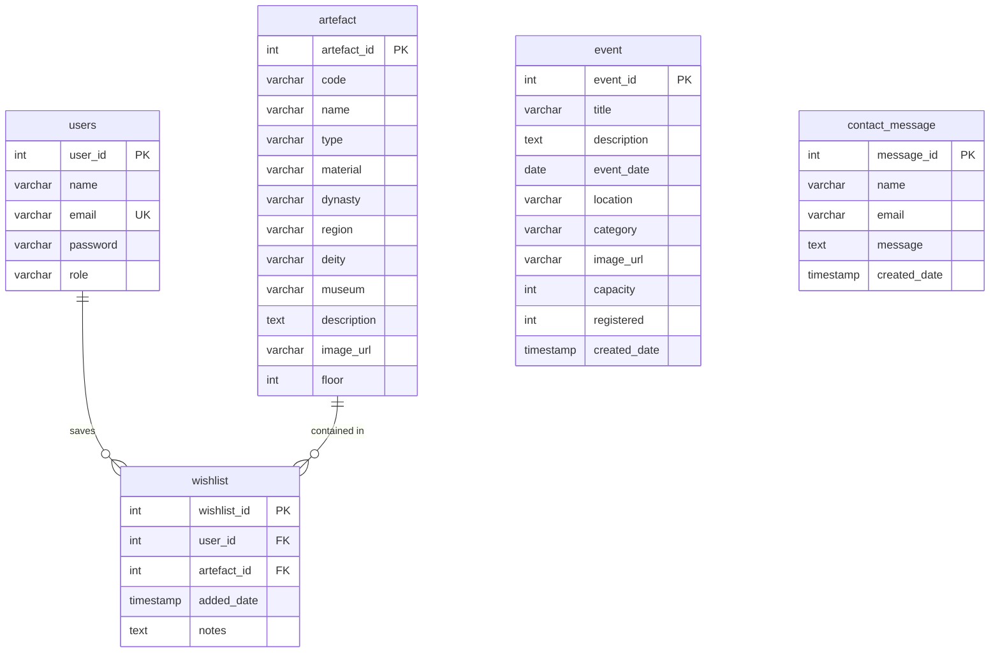

# Sri Krishna Museum — Digital Cultural Heritage & Virtual Exploration Portal

[](https://www.oracle.com/java/technologies/javase/jdk17-archive-downloads.html)
[](https://spring.io/projects/spring-boot)
[](https://www.mysql.com/)
[](https://www.thymeleaf.org/)
[]()

A full-stack enterprise web application engineered for the **Sri Krishna Museum** in Kurukshetra, Haryana. The platform digitizes cultural preservation, cataloging **60+ historical artefacts** across 3 physical museum floors, with interactive gallery navigation, chronological timeline exploration, cultural event reservations, a hybrid offline-first wishlist system, and role-based administration.

---

## Table of Contents

- [Architectural Overview](#architectural-overview)
- [Key Features](#key-features)
- [Technology Stack](#technology-stack)
- [System Architecture](#system-architecture)
- [Database Schema & Constraints](#database-schema--constraints)
- [REST API Specification](#rest-api-specification)
- [Project Directory Structure](#project-directory-structure)
- [Getting Started & Local Setup](#getting-started--local-setup)
- [Default System Credentials](#default-system-credentials)
- [Engineering Highlights & Design Patterns](#engineering-highlights--design-patterns)
- [Future Enhancements](#future-enhancements)

---

## Architectural Overview

The application follows the **Model-View-Controller (MVC)** architectural pattern with clean layer separation:
- **Presentation Layer:** Server-rendered Thymeleaf templates enhanced with modular, event-driven vanilla JavaScript and responsive CSS3.
- **Controller Layer:** RESTful Spring MVC controllers exposing standardized JSON endpoints and routing view models.
- **Persistence Layer:** Spring JDBC (`JdbcTemplate`) with parameterized queries, prepared statements, and custom row mappers.
- **Data Layer:** Normalized MySQL 8.0 relational database with referential integrity, cascading deletes, custom `CHECK` constraints, and B-tree indexes.

---

## Key Features

### 1. Curated Artefact Catalog & Smart Discovery
- **Comprehensive Catalog:** Houses 60 authentic museum artefacts spanning Sculptures, Paintings, Coins, Inscriptions, and Ritual Objects.
- **Multi-Attribute Search:** Real-time search across artefact title, dynasty, regional origin, deity attribution, and physical floor location.
- **Dynamic Category & Multi-Filter:** Client-side instant filtering by dynasty era, material composition, and artefact type.

### 2. Physical Museum Floor-by-Floor Walkthrough (`/travel`)
- Virtual floor navigation corresponding to the museum's physical galleries:
  - **Floor 1:** Ancient Sculptures (Deities, Vishnu iconography, Chola bronzes).
  - **Floor 2:** Paintings & Manuscripts (Mahabharata miniatures, palm leaf texts, Pichwai art).
  - **Floor 3:** Numismatics & Ritual Objects (Ancient coins, temple bells, ceremonial antiquities).

### 3. Chronological Visual Timeline (`/timeline`)
- Alternating chronological timeline organizing artefacts by historical period, dynasty, and floor sequence for educational walkthroughs.

### 4. Hybrid Client-Server Wishlist System (`/wishlist`)
- **Offline-First for Guests:** Unauthenticated visitors can save favourites locally in `localStorage` (`guest_wishlist`).
- **Automatic Account Sync:** Upon user login, locally saved items merge seamlessly with user records in MySQL (`wishlist` table).
- **Reactive UI:** Instant toggle between saved states with real-time top-navbar counter badges across all pages.

### 5. Cultural Events & Registration Engine (`/events`)
- Exhibition, workshop, and cultural program schedule with real-time seat tracking (`registered` vs. `capacity`).
- Dynamic user registration / unregistration toggle.

### 6. Visitor Inquiries & Ratings
- **Inquiry Form (`/contact`):** Validated contact submissions persisted to the `contact_message` table.
- **Community Ratings & Reviews:** 5-star rating system with discussion comments and review feeds per artefact.

### 7. Administration & Role-Based Access Control (`/admin`)
- Role-based separation (`ADMIN` vs. `USER`).
- Administrator portal for adding new artefacts to the catalog and publishing upcoming cultural events.
- Client-side navigation guards and server-side authorization checks.

### 8. Accessibility & Modern UX
- Dual-theme system: Day mode and Krishna Dark mode with persistent user preference (`Ctrl+T`).
- Global search shortcut (`Ctrl+K`) and keyboard modal dismiss (`Escape`).

---

## Technology Stack

| Layer | Technology | Description |
| :--- | :--- | :--- |
| **Language** | Java 17 (LTS) | Modern Java syntax, strong typing, pattern matching |
| **Framework** | Spring Boot 3.5.0 | Web MVC, JDBC Starters, DevTools |
| **Template Engine** | Thymeleaf 3.x | Clean server-side HTML rendering |
| **Database** | MySQL 8.0 | Relational storage with foreign key constraints |
| **Data Access** | Spring `JdbcTemplate` | Optimized SQL queries without ORM overhead |
| **Build Tool** | Apache Maven 3.9+ | Dependency resolution and lifecycle management |
| **Frontend** | Vanilla JavaScript (ES6+), CSS3 | 13 modular JS components, 0 external runtime libraries |

---

## System Architecture



---

## Database Schema & Constraints

The relational schema is configured in [`krishna_museum.sql`](./krishna_museum.sql) and enforces strict referential integrity:



### Key Schema Constraints
- **Unique Wishlist Records:** `UNIQUE KEY unique_user_artefact (user_id, artefact_id)` prevents duplicate bookmarks per user.
- **Cascading Deletes:** Foreign keys on `wishlist` enforce `ON DELETE CASCADE` when artefacts or users are deleted.
- **Check Constraints:** `CHECK (type IN ('Sculpture','Painting','Coin','Inscription','Ritual Object'))`.
- **Search Indexes:** B-tree indexes applied on frequently filtered columns:
  - `idx_name ON artefact(name)`
  - `idx_type ON artefact(type)`
  - `idx_dynasty ON artefact(dynasty)`
  - `idx_deity ON artefact(deity)`

---

## REST API Specification

### Artefacts Catalog (`/api/artefacts`)

| Method | Endpoint | Access | Description |
| :--- | :--- | :--- | :--- |
| `GET` | `/api/artefacts` | Public | Retrieve entire curated collection (60 items) |
| `GET` | `/api/artefacts/{id}` | Public | Retrieve detailed entity by artefact ID |
| `GET` | `/api/artefacts/floor/{floor}` | Public | Filter collection by museum floor (1, 2, or 3) |
| `GET` | `/api/artefacts/search?keyword={q}` | Public | Full-text substring search across catalog attributes |
| `POST` | `/api/artefacts/admin/add` | Admin | Insert new artefact into database |

### Cultural Events (`/api/events`)

| Method | Endpoint | Access | Description |
| :--- | :--- | :--- | :--- |
| `GET` | `/api/events` | Public | List all scheduled cultural programs |
| `GET` | `/api/events/upcoming` | Public | List upcoming events sorted chronologically |
| `GET` | `/api/events/{id}` | Public | Retrieve event specifications and capacity |
| `POST` | `/api/events/admin/add` | Admin | Publish new cultural event |

### Authentication & Users (`/api/users`)

| Method | Endpoint | Access | Description |
| :--- | :--- | :--- | :--- |
| `POST` | `/api/users/register` | Public | Register new visitor account (`role: USER`) |
| `POST` | `/api/users/login` | Public | Authenticate user and initialize session |
| `POST` | `/api/users/profile` | Authenticated | Update account profile details |

### Wishlist Synchronizer (`/api/wishlist`)

| Method | Endpoint | Access | Description |
| :--- | :--- | :--- | :--- |
| `GET` | `/api/wishlist` | Authenticated | Fetch array of saved artefact IDs |
| `GET` | `/api/wishlist/artefacts` | Authenticated | Fetch complete entity payload of saved items |
| `POST` | `/api/wishlist/toggle/{artefactId}` | Public / User | Toggle saved status in database (or guest mode) |

### Visitor Inquiries (`/api/contact`)

| Method | Endpoint | Access | Description |
| :--- | :--- | :--- | :--- |
| `POST` | `/api/contact` | Public | Submit visitor question or group tour inquiry |

---

## Project Directory Structure

```text
krishna-museum/
├── pom.xml                                  # Maven project object model (Java 17, Spring Boot)
├── mvnw / mvnw.cmd                          # Maven wrapper binaries for Unix / Windows
├── krishna_museum.sql                       # Complete schema definition, triggers & seed records
├── README.md                                # Project documentation
└── src/
    ├── main/
    │   ├── java/com/museum/krishna_museum/
    │   │   ├── KrishnaMuseumApplication.java # Spring Boot entry point
    │   │   ├── controller/
    │   │   │   ├── ArtefactController.java  # Artefact CRUD & search APIs
    │   │   │   ├── ContactController.java   # Inquiry submission handling
    │   │   │   ├── EventController.java     # Event listings & admin addition
    │   │   │   ├── HomeController.java      # Page template view routing
    │   │   │   ├── UserController.java      # Auth & profile management
    │   │   │   └── WishlistController.java  # Persistent wishlist sync
    │   │   ├── model/
    │   │   │   ├── Artefact.java            # Artefact data transfer model
    │   │   │   ├── Event.java               # Cultural event entity
    │   │   │   └── User.java                # Serializable user model
    │   │   └── repository/
    │   │       ├── ArtefactRepository.java  # Spring JdbcTemplate operations
    │   │       ├── EventRepository.java     # Event queries & mutations
    │   │       └── UserRepository.java      # User queries & session updates
    │   └── resources/
    │       ├── application.properties       # Database credentials & server configuration
    │       ├── static/
    │       │   ├── css/style.css            # Responsive themes & animations
    │       │   ├── images/                  # 60 curated museum artefact photographs
    │       │   └── js/                      # 13 modular vanilla JavaScript components
    │       │       ├── admin.js             # Admin tab switching & form handlers
    │       │       ├── advanced-filters.js  # Dynamic multi-attribute filtering
    │       │       ├── animations.js        # UI micro-interactions & shortcuts
    │       │       ├── artefacts.js         # Catalog rendering & detail view
    │       │       ├── auth.js              # Client auth flows & validation
    │       │       ├── dashboard.js         # User dashboard & statistics
    │       │       ├── events.js            # Event listings & registration toggle
    │       │       ├── home.js              # Hero carousel & featured items
    │       │       ├── script.js            # Global navbar & modal utilities
    │       │       ├── theme-toggle.js      # Day / Dark mode persistence
    │       │       ├── timeline.js          # Chronological timeline logic
    │       │       ├── travel.js            # Interactive floor navigation
    │       │       └── wishlist.js          # Hybrid local/remote wishlist engine
    │       └── templates/                   # Thymeleaf HTML5 layouts
    │           ├── index.html               # Home landing page
    │           ├── artefacts.html           # Full catalog & discovery
    │           ├── wishlist.html            # Dedicated personal wishlist
    │           ├── travel.html              # Museum floor guide
    │           ├── timeline.html            # Chronological historical timeline
    │           ├── events.html              # Cultural programs & booking
    │           ├── about.html               # Museum history & vision
    │           ├── contact.html             # Visitor inquiry form & reachability
    │           ├── login.html               # User & admin authentication
    │           ├── register.html            # New user account creation
    │           ├── dashboard.html           # Authenticated user dashboard
    │           └── admin.html               # Administrator curation portal
    └── test/
        └── java/com/museum/krishna_museum/
            └── KrishnaMuseumApplicationTests.java # Context loading integration tests
```

---

## Getting Started & Local Setup

### Prerequisites
- **Java Development Kit (JDK):** Version 17 or higher (`java -version`)
- **Relational Database:** MySQL Server 8.0+ running locally on port 3306
- **Build Tool:** Maven (or use bundled `./mvnw.cmd` / `./mvnw`)

### 1. Database Initialization
1. Start your local MySQL service.
2. Run the provided database migration script to construct the tables, indexes, and initial 60-item catalog:
   ```bash
   mysql -u root -p < krishna_museum.sql
   ```
   *(Or execute the queries in MySQL Workbench)*.

### 2. Configure Credentials
Check [`src/main/resources/application.properties`](./src/main/resources/application.properties) and match your local MySQL configuration:
```properties
spring.datasource.url=jdbc:mysql://localhost:3306/krishna_museum
spring.datasource.username=root
spring.datasource.password=YOUR_MYSQL_PASSWORD
spring.datasource.driver-class-name=com.mysql.cj.jdbc.Driver
```

### 3. Build & Run Application
From the project root directory:

**Windows (PowerShell / Command Prompt):**
```powershell
.\mvnw.cmd clean compile
.\mvnw.cmd spring-boot:run
```

**Linux / macOS:**
```bash
./mvnw clean compile
./mvnw spring-boot:run
```

Once initialized, open your browser and navigate to:
**[http://localhost:8080](http://localhost:8080)**

---

## Default System Credentials

| Role | Email Address | Password | Privileges |
| :--- | :--- | :--- | :--- |
| **System Administrator** | `admin@gmail.com` | `admin123` | Full access to `/admin`, catalog curation, and event scheduling |
| **Default Visitor** | `user@gmail.com` | `user123` | Personal dashboard, registered events, synchronized wishlist |

> **Note:** New visitors can register dynamically via the **[Register](http://localhost:8080/register)** view.

---

## Engineering Highlights & Design Patterns

1. **Zero External Frontend Dependencies:**
   - Designed without bulky heavy frontend frameworks (React/Angular/Vue) or heavy CSS frameworks (Bootstrap). Clean, performant, native JavaScript and pure CSS deliver sub-second initial page load times.
2. **Hybrid Offline/Online State Management:**
   - Eliminates login friction for guest users by providing full bookmarking functionality in local storage that upgrades effortlessly to relational database records upon account authentication.
3. **Defensive SQL & Performance Tuning:**
   - Parameterized queries inside `JdbcTemplate` prevent SQL injection vulnerabilities.
   - Strategic composite indexes (`idx_name`, `idx_type`, `idx_dynasty`, `idx_deity`) ensure catalog lookups execute in constant time $O(1)$ to logarithmic time $O(\log n)$.
4. **Resilient Error Handling:**
   - Fallback image handlers (`onerror="this.src='/images/default-event.jpg'"`) prevent broken image states.
   - Comprehensive HTTP status codes (`200 OK`, `400 Bad Request`, `401 Unauthorized`, `500 Internal Error`) returned across all REST endpoints.

---

## Future Enhancements

- [ ] **Cryptographic Security:** Migrate plaintext credentials to salted `BCryptPasswordEncoder` hashes with Spring Security filter chains.
- [ ] **Admin Inquiries Dashboard:** Embed an administrative view inside `/admin` to browse, filter, and respond to incoming visitor inquiry records from `contact_message`.
- [ ] **Automated Test Suite:** Expand integration test coverage with JUnit 5 and `MockMvc` controller test runners.
- [ ] **Digital Audio Tour:** Integrate HTML5 Web Audio API players providing multi-lingual audio guides for each exhibition gallery.
